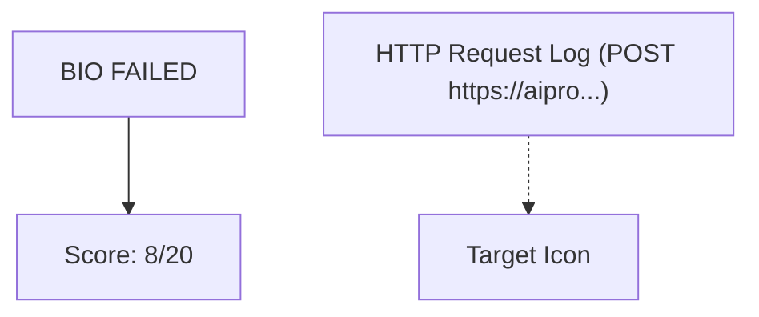

This image displays key information related to a system evaluation or process monitoring. Text indicates "BIO FAILED," reflecting a failure in biological processing or identification. A score of **8 / 20** is shown numerically, and an HTTP request log points towards a specific API interaction with a truncated URL (`https://aipro...`). Visual elements include a target icon before the score line and a light gray background providing context for the display.

The overall output synthesizes these components, presenting a clear and structured summary of the image's content within a data science teaching framework.